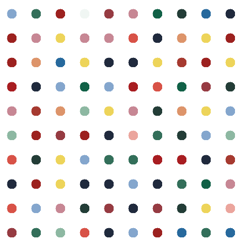

# Day18

## Project to solidify material learned 

### Damien Hirst's spot painting:

> Use turtle graphics to create a Damien Hirst's spot art work


#### Preview:



## How to run this on your device

- Clone this repository
```
git clone https://github.com/kingdreamerr/Day18_Turtle_graphics.git
```
- cd into the repo
```
cd Day18_Turtle_graphics
```

- Paste the following in the terminal 
```
python3 main.py
```
